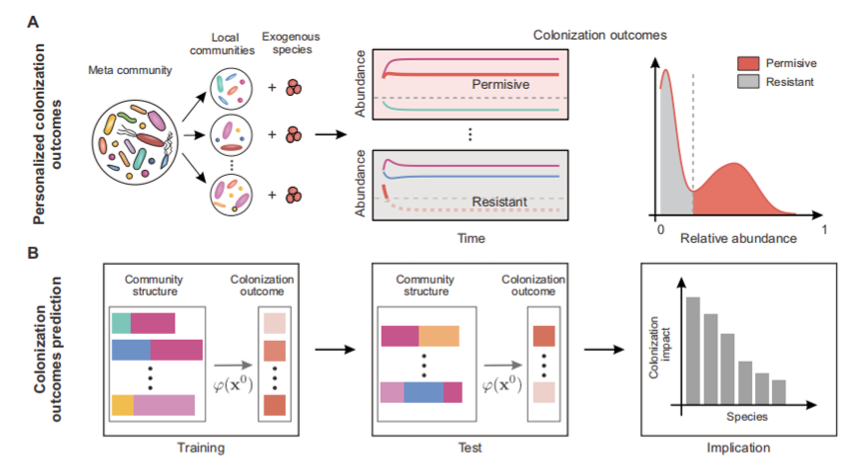

# COP (Predict colonization outcomes for complex microbial communities)

This is a Pytorch and Sklearn implementation of COP, as described in our paper:

Wu, L., Wang, X.W., Tao, Z., Wang, T., Zuo, W., Zeng, Y., Liu, Y.Y. and Dai, L.. [Data-driven prediction of colonization outcomes for complex microbial communities]. bioRxiv, pp.2023-03 (2023).

We have tested this code for Python 3.8.13 and R 4.1.2.

  

## Contents

- [Overview](#overview)
- [Repo Contents](#repo-contents)
- [Data type for DKI](#Data-type-for-DKI)
- [How the use the DKI framework](#How-the-use-the-DKI-framework)

# Overview

Complex microbial interactions can lead to different colonization outcomes of exogenous species, be they pathogenic or beneficial in nature. Predicting the colonization of exogenous species in complex communities remains a fundamental challenge in microbial ecology, mainly due to our limited knowledge of the diverse physical, biochemical, and ecological processes governing microbial dynamics. Here, we proposed a data-driven approach independent of any dynamics model to predict colonization outcomes of exogenous species from the baseline compositions of microbial communities. We systematically validated this approach using synthetic data, finding that machine learning models (including Random Forest and neural ODE) can predict not only the binary colonization outcome but also the post-invasion steady-state abundance of the invading species. Then we conducted colonization experiments for two commensal gut bacteria species Enterococcus faecium and Akkermansia muciniphila in hundreds of human stool-derived in vitro microbial communities, confirming that the data-driven approach can successfully predict the colonization outcomes. Furthermore, we found that while most resident species were predicted to have a weak negative impact on the colonization of exogenous species, strongly interacting species could significantly alter the colonization outcomes, e.g., the presence of Enterococcus faecalis inhibits the invasion of E. faecium. The presented results suggest that the data-driven approach is a powerful tool to inform the ecology and management of complex microbial communities.

# Repo Contents
(1) R codes to generated synthetic dataset.

(2) A synthetic dataset generated by gLV population dyanmics to test the Data-driven Colonization Outcome Predciton (COP) framework.

(3) Python code to predict the colonized abudnace from the baseline taxanomic profile (Pytorch and Sklearn).

# Data type for COP
## (1) Ptrain.csv: matrix of taxanomic profile of size N*M, where N is the number of taxa and M is the sample size (without header).

## (2) Thought experiment: thought experiemt was realized by removing each present species in each sample. This will generated three data type.

